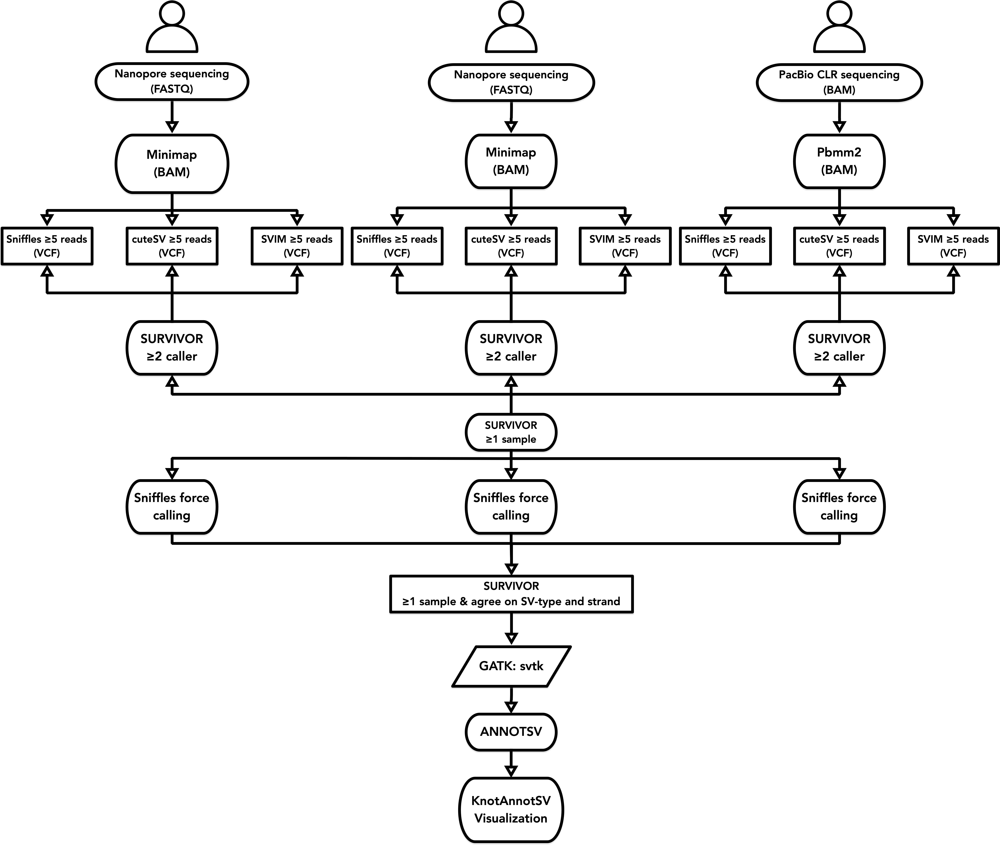

# RB-SV
Pipeline of structural-variation calling for Retinoblastoma samples

## Sample Information

| CustomerID | Name   | Group | SampleID | Data                  |
| --- |--------| --- | --- |-----------------------|
| FC_RB | 范宸乐    | RB | N02 | Nanopore sequencing   |
| FJ | 范家乐    | WT_RB | N01 | Nanopore sequencing   |
| ZJ | 朱玥雯之姐  | WT_RB_TSC | N03 | Nanopore sequencing   |
| ZY_RT | 朱玥雯    | RB_TSC | N04 | Nanopore sequencing   |
| unkown | unkown | unkown | BJ181303-02 | PacBio CLR sequencing |
| unkown | unkown    | unkown | HPDE6C7 | PacBio CLR sequencing   |
| unkown | unkown    | unkown | PANC1 | PacBio CLR sequencing  |

## Pipeline

A two-step structural variation (SV) detection pipeline was used for the dataset, 
i.e., breakpoints were first detected per each sample, and then merged to genotype for the population. 
Detailed information was described as follows.

1. Minimap2 was used to align each sample by nanopore sequencing to GRCh38 reference, using the default parameters of Minimap for ONT.

    ```shell
      minimap2 --MD -ax map-ont -t $NTHREADS $PATH_REFERENCE_FASTA $PATH_NANOPORE_FASTQ |
        samtools sort -@ $NTHREADS -o $PATH_TO_SAVE_DATA/$RESULT_BAM
      samtools index -@ $NTHREADS $PATH_TO_SAVE_DATA/$RESULT_SORTED_BAM;
    ```
2. Pbmm2 was used to align each sample by PacBio sequencing to GRCh38 reference.

    ```shell
      pbmm2 align $PATH_REFERENCE_MMI $PATH_PACBIO_BAM_SUBREADS $PATH_TO_SAVE_DATA/$RESULT_SORTED_BAM \
        --sort --bam-index BAI -j $NTHREADS -J $NTHREADS --median-filter
    ```
   
3. For each sample, SV was detected simultaneously using Sniffles, cuteSV and SVIM. In addition, pbsv was used to detect SVs from PacBio data instead of cuteSV. For each SV signature, a length of 50 bp and at least 5 supporting-reads are required. Each tool is required to record sequences of insertions and ID of supporting-reads.

   ```shell
      sniffles -s 5 -t $NTHREADS -l 50 -n -1 \
        -m $PATH_TO_SAVE_DATA/$RESULT_SORTED_BAM -v $PATH_TO_SAVE_DATA/$RESULT_VCF_SNIFFLES
   ```

   ```shell
        cuteSV --threads $NTHREADS \
          --sample $SAMPLEID \
          --min_support 5 \
          --report_readid \
          --genotype --min_size 50 \
          --max_cluster_bias_INS 100 \
          --diff_ratio_merging_INS 0.3 --max_cluster_bias_DEL 100 --diff_ratio_merging_DEL 0.3 \
          $PATH_TO_SAVE_DATA/$RESULT_SORTED_BAM $PATH_REFERENCE_FASTA $PATH_TO_SAVE_DATA/$RESULT_VCF_CUTESV $PATH_TO_SAVE_DATA/
   ```

   ```shell
      pbsv discover \
        --tandem-repeats $HUMAN_GRCH38_NO_ALT_ANALYSIS_SET.TRF.BED \
        $PATH_TO_SAVE_DATA/$RESULT_SORTED_BAM $PATH_TO_SAVE_DATA/$RESULT_SV_SIGNATURE
   
      pbsv call \
        --gt-min-reads 5 \
        --call-min-reads-one-sample 5 \
        --call-min-reads-all-samples 5 \
        -j 40 \
        -m 50 \
        $PATH_REFERENCE_FASTA $PATH_TO_SAVE_DATA/$RESULT_SV_SIGNATURE $PATH_TO_SAVE_DATA/$RESULT_VCF_PBSV
   ```

   ```shell
      svim alignment --sample $SAMPLEID \
        --insertion_sequence \
        --min_sv_size 50 \
        --minimum_depth 5 \
        --read_names \
        --heterozygous_threshold 0.3 \
        $PATH_TO_SAVE_DATA $PATH_TO_SAVE_DATA/$RESULT_SORTED_BAM $PATH_REFERENCE_FASTA
   
      bcftools view -i 'QUAL >= 10 & SUPPORT >= 5' $PATH_TO_SAVE_DATA/variants.vcf > $PATH_TO_SAVE_DATA/$RESULT_VCF_SVIM
   ```
   
4. For each sample, SVs detected by above three methods were combined using SURVIVOR, requiring that each SV be detected by at least two tools and that adjacent SVs be separated by more than 1 kbp. The SVs detected by different software around the same location do not need to have the same SVtype or the same orientation, which is to obtain as many breakpoints with high confidence as possible. Finally breakpoints detected by all samples are merged using SURVIVOR and each breakpoint must be supported by at least one sample.

   ```shell
     for sampleID in $(ls $PATH_TO_SAVE_DATA); do   
         SURVIVOR merge $PATH_TO_SAVE_DATA/$SAMPLEID/LIST_MERGE_METHOD 1000 2 1 1 0 50 $PATH_TO_SAVE_DATA/$SAMPLEID/$SAMPLEID_VCF_MERGE_METHOD
     done
   
     SURVIVOR merge $PATH_TO_SAVE_DATA/LIST_MERGE_SAMPLE 1000 1 1 0 0 50 $PATH_TO_SAVE_DATA/$RESULT_VCF_MERGE_SAMPLE
   ```
5. Finally, we need to get a multi-sample vcf with complete genotypes. We re-run Sniffles and genotyped for each sample in all these potential breakpoints and then merge them using SURVIVOR. In this run, SURVIVOR only report SVs supported by at least one sample, and must have the same SVtype. In addition, we used a hard threshold of five supporting-reads, and all breakpoints smaller than this threshold were modified to ref (0/0).
   
   ```shell
    sniffles -s 5 -t $NTHREADS -l 50 -n -1 \
      -m $PATH_TO_SAVE_DATA/$RESULT_SORTED_BAM \
      -v $PATH_TO_SAVE_DATA/$RESULT_VCF_FORCE \
      --Ivcf $PATH_TO_SAVE_DATA/$RESULT_VCF_MERGE_SAMPLE
   ```
   
   ```shell
    SURVIVOR merge $PATH_TO_SAVE_DATA/LIST_MERGE_SAMPLE 1000 -1 1 1 0 50 $PATH_TO_SAVE_DATA/$RESULT_VCF_MERGE_SAMPLE_FORCE
   ```

6. We constructed the Ensembl Canonical transcript for GRCh38 and then annotated all regions where SVs are located using svtk in GATK.

   ```shell
      svtk annotate --gencode $GENCODE_GRCH38_CANONICAL_ANNOTATION_GTF \
        $PATH_TO_SAVE_DATA/$RESULT_VCF_FORCE $PATH_TO_SAVE_DATA/$RESULT_VCF_FORCE_SVTK
   ```
   
7. 使用AnnotSV对所有SV进行了全面的注释，并且使用KnotAnnotSV对注释内容进行了可视化，便于查看。

   ```shell
      AnnotSV -SVinputFile $PATH_TO_SAVE_DATA/$RESULT_VCF_FORCE_SVTK \
        -outputDir $PATH_TO_SAVE_DATA/ \
        -outputFile $RESULT_ANNOTSV_TSV \
        -promoterSize 2000 \
        -overlap 50 \
        -genomeBuild GRCh38 \
        -annotationMode full
   
      perl knotAnnotSV.pl \
        --configFile CONFIG_ANNOTSV_YAML \
        --annotSVfile $PATH_TO_SAVE_DATA/$RESULT_ANNOTSV_TSV \
        --outDir $PATH_TO_SAVE_DATA/ \
        --outPrefix $PATH_TO_SAVE_DATA/$RESULT_ANNOTSV_TSV \
        --genomeBuild hg38
   ```
   



## Environments

| Softwares   | Version    |
|-------------|------------|
| Minimap     | 2.22-r1101 |
| pbmm2       | 1.5.0      |
| samtools    | 1.7        |
| htslib      | 1.7-2      |
| Sniffles    | 1.0.12     |
| pbsv        | 2.4.1      |
| CuteSV      | 1.0.8      |
| SVIM        | 2.0.0      |
| SURVIVOR    | 1.0.7      |
| bcftools    | 1.9        |
| GATK: svtk  | 0.1        |
| AnnotSV     | 3.0.9      |
| KnotAnnotSV | 1.1.1      |
| R           | 4.0.5      |
| Metascape   | 3.5        |
